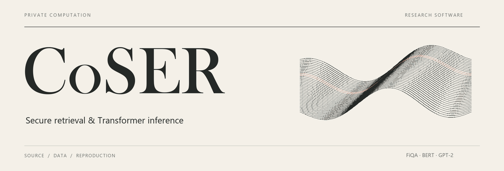

<picture>
  <source media="(prefers-reduced-motion: reduce)" srcset="coser-banner.svg">
  
</picture>

<p align="center">
  <a href="#quick-start"><strong>Quick start</strong></a> &nbsp; · &nbsp;
  <a href="REPRODUCING.md">Reproduction guide</a> &nbsp; · &nbsp;
  <a href="DATA.md">Data sources</a> &nbsp; · &nbsp;
  <a href="LOCAL_REPRODUCTION.md">Verified checks</a> &nbsp; · &nbsp;
  <a href="EXPERIMENTS.md">Experiment map</a>
</p>

**CoSER** is a research implementation for secure retrieval and Transformer inference. This repository contains the source and experiment records for FiQA retrieval, the correction-protocol ablation, BERT-base, BERT-large, GPT-2, and the paper's client–cloud WAN comparisons.

<table>
  <tr>
    <td width="33%" valign="top">
      <strong>01 &nbsp; Build from source</strong><br><br>
      Native C++, Python interfaces, baseline adapters and pinned dependency sources.<br><br>
      <a href="#quick-start">Start the local build →</a>
    </td>
    <td width="33%" valign="top">
      <strong>02 &nbsp; Check the outputs</strong><br><br>
      Two-party native protocols checked against independent integer references.<br><br>
      <a href="LOCAL_REPRODUCTION.md">Read the verification record →</a>
    </td>
    <td width="33%" valign="top">
      <strong>03 &nbsp; Reproduce a workload</strong><br><br>
      Pinned datasets, checkpoint preparation and commands for each supported workload.<br><br>
      <a href="#choose-a-reproduction-route">Choose a route →</a>
    </td>
  </tr>
</table>

Shared-host and WAN implementations are kept separately where they differ. Recorded build commands, source hashes, public arithmetic checks and table inputs accompany the code. The banner is illustrative; it does not represent measured protocol timing. A [static banner](coser-banner.svg) is also available.

## Start here

For a first reproduction, follow the **[quick start](#quick-start)** below. It builds CoSER from source and executes real two-party protocols on public synthetic inputs, with every output checked against an independent integer reference. It needs neither trained weights nor a cloud account. Dataset-backed retrieval, trained-model entries and external frameworks have separate **[workload routes](#choose-a-reproduction-route)**.

### Tested environment and resources

| Item | Configuration |
| --- | --- |
| Operating system | Ubuntu 24.04 x86-64, including Ubuntu under WSL 2 |
| Compiler and build tools | GCC 13; the release was checked with GCC 13.3, CMake 3.28 and Ninja 1.11 |
| Python | System Python 3.12 for the quick start; model and corpus-encoder routes create their own pinned environments |
| CPU | AES, AVX2 and PCLMUL instructions; use two compiler jobs initially |
| Build memory | Allow 12 GiB for the source-build workflow with two jobs |
| Protocol-check memory | The public production checks were qualified with a 32 GiB allowance; this is a tested configuration, not a measured minimum |
| Disk | Reserve 50 GiB when building the complete collection, including external framework caches and prepared data; the native-only route is smaller |
| GPU and cloud | Neither is required for local reproduction |

Use a directory without spaces **inside the Linux filesystem**, such as your Linux home directory. On Windows, run the commands in the Ubuntu terminal, not PowerShell, and avoid building under `/mnt/c`. Check available physical RAM as well as any WSL/container limit. Complete trained models need more memory than compilation or public checks; their requirements are in the workload guide.

## Quick start

Run these steps in order in the same Ubuntu shell. Stop and inspect the reported error if a command fails. All generated build files and check outputs will be kept under `COSER_REPRO`.

### 1. Install system packages

```sh
sudo apt-get update
sudo apt-get install -y build-essential gcc-13 g++-13 cmake ninja-build \
  pkg-config libssl-dev libgmp-dev m4 patch python3 python3-venv unzip
```

### 2. Download, extract and verify the release

Download **[CoSER-source.zip](CoSER-source.zip)**, **[CoSER-dependencies.zip](CoSER-dependencies.zip)** and **[SHA256SUMS](SHA256SUMS)** from the same repository revision. Place the three files together in a Linux directory and open a terminal there. GitHub's automatic “Download ZIP” contains these files too; after extracting it, the two inner archives must still be extracted.

```sh
awk '$2 == "CoSER-source.zip" || $2 == "CoSER-dependencies.zip"' SHA256SUMS > archive-checksums.txt
test "$(wc -l < archive-checksums.txt)" -eq 2 && sha256sum --check archive-checksums.txt
```

Continue only after **both archives report `OK`**. Extract into a directory that does not already contain an older `CoSER/` tree:

```sh
unzip CoSER-source.zip
unzip CoSER-dependencies.zip
cd CoSER
python3 tools/verify.py
python3 tools/check_environment.py
```

Both archives share the `CoSER/` root: the source archive provides code and tools, and the dependency archive supplies `third_party/`. The verifier checks the full release and original source hashes. Both Python commands must report `"status": "PASS"` before building.

### 3. Build the native entries

Choose a fresh work directory; if the example name already exists, choose another name rather than deleting its contents.

```sh
export COSER_REPRO="$HOME/coser-reproduction"
mkdir "$COSER_REPRO"
python3 tools/build_native.py --work "$COSER_REPRO/native" --jobs 2 --target all
```

This builds the dependencies, four CoSER Transformer entries and five retrieval/ablation entries from source. It does not reuse archived experimental binaries. The build prints `"status": "PASS"` and writes `native/BUILD_RESULT.json` with the nine executable paths and hashes. Compiler commands and diagnostics are retained under `native/logs/`.

### 4. Execute the two-party correctness suite

```sh
python3 tools/test_native.py --work "$COSER_REPRO/native" \
  --output "$COSER_REPRO/native/public"
```

The helper builds a production-consumer fixture against the new libraries, starts both parties, and checks both protocol modes and both role mappings. Attention and the same normalization, field, GELU and CRT-tail owners are exercised before and after owner reuse. The supplied suite checks **11,645,888 integer outputs** across four cases. No checkpoint download is needed.

Success requires all of the following:

- The terminal ends with **`PASS ALL PUBLIC CHECKS`**.
- `native/public/RESULT.json` reports `"status": "PASS"` and contains all four cases.
- Each case's `EXIT.json` contains two zero exit codes; the final result confirms the test ports are free.

A build-only `PASS` is not the completion signal for this step. This suite checks the native protocols, while full trained-model and dataset-backed retrieval commands check their respective workloads.

### 5. Recompute the recorded tables (optional)

```sh
python3 tools/summarize_results.py --output "$COSER_REPRO/measurements.json"
```

This recalculates the archived retrieval and ablation tables. It does not launch an experiment or recreate a WAN measurement. Public equation checks and the full target list are in [the build and correctness guide](REPRODUCING.md#2-build-and-run-public-correctness-checks).

## Choose a reproduction route

| Workload | Next steps |
| --- | --- |
| External frameworks and model runtime | [Build the pinned BumbleBee runtime, verify its three MPC cases, and build Panther/Pisces](REPRODUCING.md#build-the-model-front-end-and-external-frameworks) |
| GPT-2, CoSER and BumbleBee | [Prepare the full checkpoint, seven-token prompt and eight-token local entries](REPRODUCING.md#gpt-2) |
| BERT-base and BERT-large | [Prepare MRPC tokens, convert/export tensors and run the CoSER/BumbleBee entries](REPRODUCING.md#bert-preparation-and-coser-entries) |
| BOLT | [Build BOLT, verify its public boundary cases, and prepare the author's word-elimination model](REPRODUCING.md#bolt-author-model) |
| CoSER, Panther and Pisces retrieval | [Encode FiQA, construct the public index and validate complete Top-10 records](REPRODUCING.md#complete-record-retrieval) |

The quick start builds CoSER; it does not implicitly build the external frameworks or install the model runtime. Follow the prerequisite build section before selecting a model or baseline route. Keep the pinned model Python environment separate from the corpus encoder environment.

Download only the assets needed for the selected workload. If the pinned assets or a successful preparation directory are already available, reuse them as described in the guide. Do not redownload a checkpoint for every framework. Preparation helpers check hashes and dimensions, and every new protocol execution requires its own output directory and fresh randomness.

All command sequences are in [REPRODUCING.md](REPRODUCING.md). Download links,
fixed revisions and tensor/record formats are in [DATA.md](DATA.md). The
[local verification record](LOCAL_REPRODUCTION.md) distinguishes source builds,
data preparation and executed correctness checks.

## Common problems

| Symptom | What to check |
| --- | --- |
| Missing `third_party/` files or release verification fails | Extract both archives from the same revision into one clean directory. Do not mix releases or bypass a failed hash check. |
| Environment check reports `false` | Read the named requirement, install the listed packages, and check the CPU flags exposed to Linux/WSL. Installing a package cannot add a missing CPU instruction. |
| Compilation stops or the process is killed | Inspect `native/logs/`, free memory and container/WSL limits. Start with `--jobs 2`; full-model memory requirements do not equal build requirements. |
| Native test reports an occupied port | The default blocks start at 22000, 22700, 23400 and 24100. Select an unused range with `--base-port`; the helper checks all 144 ports. A base of 25000 is an example, provided those ports are free. Do not terminate unrelated services. |
| A check refuses its output directory | Select a new output directory. Keep the failed directory and its logs for diagnosis; do not overwrite it with a later result. |
| BumbleBee/SPU fails to import or reports a Python ABI mismatch | Use the separate pinned model environment and the source-built wheel installed by `install_bumblebee.py`. The model interpreter is Python 3.11, not the quick start's system Python. Run the runtime installation and public MPC checks before a model entry. |
| An external source build times out | Inspect its `attempts/` logs. For `build_external.py` only, continue the unchanged incomplete build with the same command plus `--resume`; do not apply this flag to other helpers. Use a fresh work tree after changing source. |
| A dataset transfer or checksum fails | Keep verification enabled and check the reported asset and pinned revision in `DATA.md`. Do not substitute another checkpoint or treat a partial download as prepared input. |
| Complete retrieval runs out of memory | Run frameworks sequentially. The supplied Panther check needs a 16 GiB allowance for its two parties, plus room for the OS; an 8 GiB limit failed. See the guide for observed memory and other workloads. |

When reporting an issue, include the failed command, OS/compiler/Python versions, the relevant `RESULT.json` or `EXIT.json`, and the first error from the build or party logs. Do not include private inputs, shares, keys or credentials.

## Generated files and cleanup

The quick start keeps restored sources, dependency builds, executables and logs under `COSER_REPRO`; the downloaded release remains separate. The longer routes also place their environments and prepared inputs there when their examples are followed. These paths are ordinary local directories and can be removed after the work is complete.

Before cleanup, wait for both parties and build processes to exit, preserve the results and logs you need, and check the exact work path and its size:

```sh
printf '%s\n' "$COSER_REPRO"
du -sh "$COSER_REPRO"
```

Remove only the confirmed reproduction directory when you no longer need its contents. Deleting files inside WSL frees Linux filesystem space but does not necessarily shrink the Windows virtual-disk file immediately.

## What is included

| Directory | Contents |
| --- | --- |
| `source/` | CoSER retrieval, transformer, arithmetic, and OT implementations |
| `baselines/` | The BOLT, BumbleBee, Panther, and Pisces adapters used by the experiments |
| `experiments/` | Shared-host, WAN, and ablation drivers, interfaces, and verification code |
| `data/` | Checkpoint conversion, quantization, data serialization, and pinned asset manifests |
| `analysis/` | Table calculations, public equation checks, and figure scripts |
| `third_party/` | Collected upstream source, including SEAL, HEXL, EMP, and BumbleBee |
| `support/` | Materialized dependency sources retained from the recorded builds |
| `provenance/` | Source hashes, compiler dependency records, build commands, and paper-to-experiment bindings |
| `tools/` | Environment checks, native builds, two-party public checks, asset acquisition and archive verification |

The release uses descriptive file names. `provenance/source-map.json` maps them back to the exact experiment sources and SHA-256 hashes. Experimental identifiers in that manifest are provenance, not additional result claims. Source contents are preserved rather than silently rewriting mathematical code during packaging.

## Data and reproduction

Read **[DATA.md](DATA.md)** for datasets, checkpoint revisions, download commands, selection rules, quantization, and role ownership. Read **[REPRODUCING.md](REPRODUCING.md)** for environments, build order, driver selection, and end-to-end timing. **[EXPERIMENTS.md](EXPERIMENTS.md)** maps the paper's experiment families to the corresponding code and evidence.

The data are public upstream assets, but the recorded private executions used separately held inputs and shares. This release does not distribute private shares, secret keys, credentials, trained-weight binaries, or a copy of the dataset. Reproduction requires downloading the pinned public assets and preparing a fresh execution with fresh randomness.

## Interpretation of the results

The reported timings belong to the recorded implementations, workloads, endpoints, and deployments. Recomputing a table verifies its arithmetic; it does not reproduce a WAN measurement. The WAN experiments use a local client and a cloud server. “Model,” “full cold start,” and “complete online retrieval” identify different service endpoints and are explained in `EXPERIMENTS.md`.

The final GPT-2 WAN observation is **1857.466667696 seconds**, compared with the recorded BumbleBee reference of **2560.092641194 seconds**, giving **1.378271…×**. The exact records and other workloads are retained in `provenance/evidence/`. This is not a claim that every deployment has the same speedup.

## Verification status

The accepted release checks are recorded in **[LOCAL_REPRODUCTION.md](LOCAL_REPRODUCTION.md)**:

| Scope | Verified result |
| --- | --- |
| Source builds | Four CoSER Transformer entries, five retrieval/ablation entries, BumbleBee, BOLT, Panther and the final Pisces adapter |
| Native public correctness | 11,645,888 CoSER integer outputs, 98,304 BOLT boundary values and 252 BumbleBee MPC outputs exact |
| Complete retrieval | CoSER, Panther and Pisces each returned and validated ten complete FiQA records |
| Data and runtime preparation | Pinned asset preparation, exact tensor export, corpus/index preparation and six model frontend/runtime entry checks passed |
| Package integrity | Source hashes, recorded compiler dependencies, both downloaded GitHub archives and every archive member checked |

The frontend checks import the real modules and native runtime; they are not complete trained-model executions. Full trained-model inference and WAN benchmarks were not repeated in this release check. Their original experimental records are preserved, and their separate execution instructions and memory requirements are documented. The evidence above establishes the listed build and correctness routes, rather than guaranteeing an identical environment or speed on every machine.

## Licenses

Third-party notices and licenses remain with their respective source directories. CoSER modifications are not relicensed by this packaging operation. No blanket license is asserted for the combined archive. Dataset and checkpoint terms are those of their upstream providers; download them from the linked sources.
